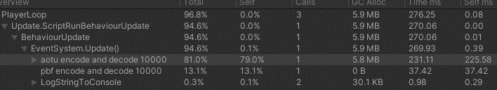

# 项目对比

1.不用一键准备资源，减少开发流程时间，没有n多协议和配置的lua散文件

2.lua代码移到Assets同级目录，避免修改lua代码unity重新导入资源

3.协议使用profobuf，网络层使用luv，全在c和lua层解决问题，encode和decode效率提升在6倍左右，但编码后空间变大（pbf每个字段都有至少一个字节的类型标识）

4.策划配置表必须load全表，表大时内存增加很大（但可考虑在c层面接入sqlite轻量级数据库解决该问题，且可扩展主键，唯一键等数据库操作，增加读表便捷，比如技能id和等级作为混合键读取技能表）

5.图集使用spriteatlas，使用路径约束，不用单独打图集

6.安卓ios真机包调试替换文件工具(https://github.com/yuyang158/AdbTool)，安卓使用adb，ios使用tidevice(https://github.com/alibaba/taobao-iphone-device)

7.使用mvvm (https://github.com/vovgou/loxodon-framework)，绑定代码和组件在prefab上，避免获取组件和资源的硬编码。缺点是需要在prefab挂各种组件，不方便与资源策划同时修改。
